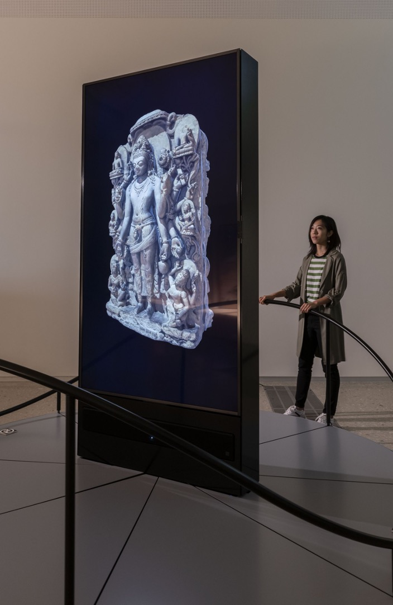
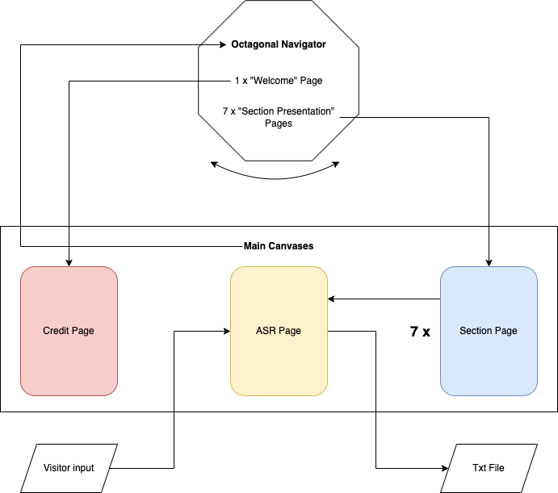

# Documentantion

## Table of content 
- [**Introduction**](#introduction)
- [**Design and Use Case**](#usecase)
- [**Software Architecture**](#softarchi)
- [**Criticalities and Further Work**](#criticalities)

## 1. Introduction <a name="introduction"></a>

"ProvokArt" is a VR experience for Oculus HMD, based on the initiative #MakartNow of the Hamburger Kunsthalle. This project consists of a set of provocative questions which have been added to traditional explanatory labels: their function is to suggest visitors new possible interpretations, highlighting what a collection of 19th century painting can still teach us about our society.

The core function of "ProvokArt" is an automatic speech recognition system, which satisfies a more and more demanded requirement in interaction design in the cultural heritage sector, i.e. the possibility of evaluating <i>in itinere</i> the prototypes, gathering data directly from the visitors. Through the verbalization process it is indeed possible to analyze the fulfillment of specific verbalization goals: transcribing the speech of the visitors and collecting it in a corpus is hence a valuable resource.

## 2. Design and Use Case <a name="usecase"></a>

Although the first proposal foresaw a virtual explorable gallery, the design of the application was considerably changed after the familiarization with the visualization systems of the Laboratory of Experimental Museology at the EPFL of Lausanne and the recognition of existing data for the 3D reconstruction of the exhibition hall. 

The website of the museum indeed only provides a panoramic view in low resolution of the main hall (Makartssaal), which was eventually used as skybox of the final UX. The absence of a sufficient amount of data and the awareness that any manual reconstruction of the room would be inaccurate led to an alternative choice. Following the suggestions provided by Prof. Kenderdine during the course "Cultural Data Sculpting", the informations have been displayed following the metaphore of the Object Navigator, a vertical screen based at the center of a turning circular platform which allows to <i>navigate</i> an object at 360°. 



The seven sections in which the project #MakartNow has been articulated and an initial welcoming section are displayed in turning octagonal shape. Users can incrementally rotate thanks to arrows in the interactive UI. Each section contains just a title and a subtitle: the paintings and the sections can be accessed through a specific button. 

Clicking on this element it is indeed possible to open a new canvas, outside the octagonal navigator, which contains for each section the corresponding paintings and questions (in the graph, "section page"). A last button allows to open a new canvas where these questions are re-proposed and visitors can transcribe their answers and save it as txt file.



As txt format can be easily processed by NLP libraries (in particular in Python), the UX does not aim exclusively at extending a non-digital born museum initiative into a virtual and immersive environment, but also to provide a useful evaluation tool for designer:


## 3. Software Architecture <a name="softarchi"></a>

Comparing to the original proposal, the main change pertains the target device. As said, the UX is developed for Oculus VR. Besides an apparent incompatibility between HTC Vive and my operating system, this choice has been supported by Prof. Pescarin, my supervisor, as the laboratory she is affiliated to (CNR ISPC) works primarily with this typology of devices. Secondly, the preparation of this project required the attendance of three different Unity Pathways: Essential, Junior Developer, and VR Development, which was based primarily for Oculus Meta devices.

The project consists mainly of interactive UI which are nested and grouped into the following objects:
- UI Manager: empty object articulated 
    - Octagonal Navigator: consists of a prism with octagonal basis (from Sketchfab) which is invisible as the material is removed. It contains the "Welcome" and the seven "Section Presentation" pages;
    - Main Content Canvas Manager: an empty object collecting credits, "Section" pages and ASR page;

Toggling between these GameObjects is made possible through part of the methods defined in the ```UIManager.cs```. The correct set up of the experience (at the beginning, only the octagonal navigator should be active) is indeed handled by ```Start```. Through the buttons of the UI it is possible to perform:
- ```OpenMainCanvas(GameObject canvasToDisplay)```: from every page of the OctagonalNavigator to the corresponding one of the MainContentCanvasManager (either credits or "Section" pages);
- ```BackToOctagon()```: from any page of the MainContentCanvasManager to the OctagonalNavigator;
- ```GoToASR(int index)```: from the "Section" pages of the MainContentCanvasManager to the ASR page. It is also responsible for reporting the questions visitors are asked to answer to;

The script also contains ```RotateOctagon(bool dir)``` to rotate the initial octagonal navigator. It also defines a method to save the transcribed answer of the visitor (see later).

To what pertains the Automatic Speech Recognition, the choice of the Oculus as target device allows to reuse <i>ad hoc</i> SDK, without adopting other strategies (such as the ones described in the proposal presentation). Meta already developed [Voice SDK](https://developer.oculus.com/documentation/unity/voice-sdk-overview/): following the guidelines provided in the [documentation](https://developer.oculus.com/documentation/unity/voice-sdk-transcription/), an "App Dictation Experience" was added. The transcribed answer is saved into .txt through the method ```SaveAnswer(TextMeshProUGUI transcribedAnswer)```.

## 4. Criticalities and Further Work <a name="criticalities"></a>
<!-- Commento rispetto alle possibili criticità della soluzione adottata. >> MODEL, transcription, inaccurate >> PROTOTIPO -->